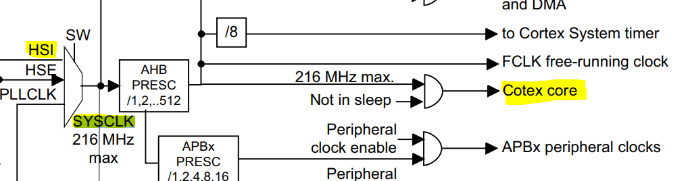

 # Exercise
 
 Write a program to create 2 tasks ***Task-1*** and ***Task-2*** with same priorities.
 When Task-1 executes it should print 
 >"Hello World from Task-1" 
 
 and when Task-2 executes it should print 
 >"Hello World from Task-2"
 
---
Case 1 : [Use ARM Semi-hosting feature to print logs on the console](https://github.com/Florin-Catalin/STM32F7_FreeRTOS/tree/arm-semi-hosting-ex1)

Case 2 : [Use UART peripheral of the MCU to print logs]( coming soon)

# Clock configuration

```c
#define configCPU_CLOCK_HZ                (SystemCoreClock)
```
```c
 uint32_t SystemCoreClock = 16000000;
```

 Derived from RC oscillator internal to the MCU. PLLCLK is used to produce high-speed clocks, up to 216 MHz. By default PLLCLK is off, and HSI is the default clock.
 
 # Startup code
```assembly
Reset_Handler:  
  ldr   sp, =_estack      /* set stack pointer */
  /* some other code*/

  /* Call the clock system initialization function.*/
  bl  SystemInit 
```
Function that sets the Clock
```c
void SystemCoreClockUpdate(void)
{
  uint32_t tmp = 0, pllvco = 0, pllp = 2, pllsource = 0, pllm = 2;
  
  /* Get SYSCLK source -------------------------------------------------------*/
  tmp = RCC->CFGR & RCC_CFGR_SWS;

  switch (tmp)
  {
    case 0x00:  /* HSI used as system clock source */
      SystemCoreClock = HSI_VALUE;
      break;
    case 0x04:  /* HSE used as system clock source */
      SystemCoreClock = HSE_VALUE;
      break;
    case 0x08:  /* PLL used as system clock source */

      /* PLL_VCO = (HSE_VALUE or HSI_VALUE / PLL_M) * PLL_N
         SYSCLK = PLL_VCO / PLL_P
         */    
      pllsource = (RCC->PLLCFGR & RCC_PLLCFGR_PLLSRC) >> 22;
      pllm = RCC->PLLCFGR & RCC_PLLCFGR_PLLM;
      
      if (pllsource != 0)
      {
        /* HSE used as PLL clock source */
        pllvco = (HSE_VALUE / pllm) * ((RCC->PLLCFGR & RCC_PLLCFGR_PLLN) >> 6);
      }
      else
      {
        /* HSI used as PLL clock source */
        pllvco = (HSI_VALUE / pllm) * ((RCC->PLLCFGR & RCC_PLLCFGR_PLLN) >> 6);      
      }

      pllp = (((RCC->PLLCFGR & RCC_PLLCFGR_PLLP) >>16) + 1 ) *2;
      SystemCoreClock = pllvco/pllp;
      break;
    default:
      SystemCoreClock = HSI_VALUE;
      break;
  }
  /* Compute HCLK frequency --------------------------------------------------*/
  /* Get HCLK prescaler */
  tmp = AHBPrescTable[((RCC->CFGR & RCC_CFGR_HPRE) >> 4)];
  /* HCLK frequency */
  SystemCoreClock >>= tmp;
}
```
